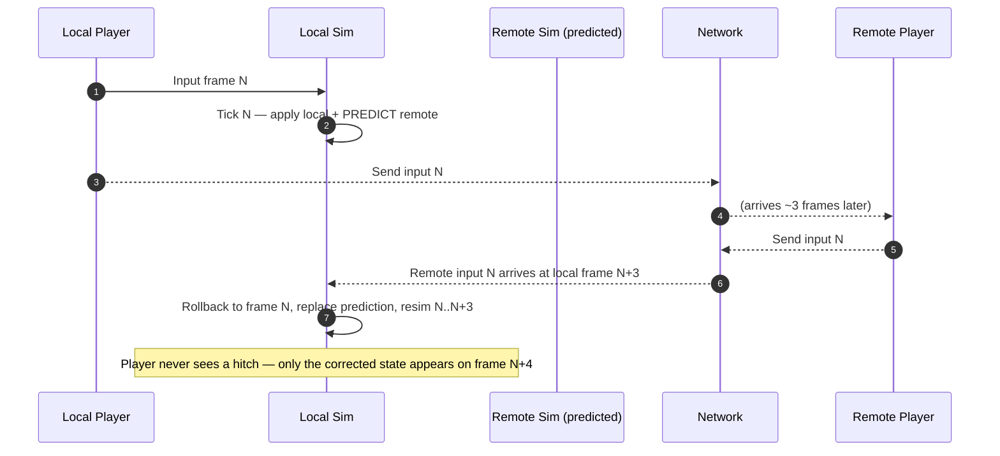
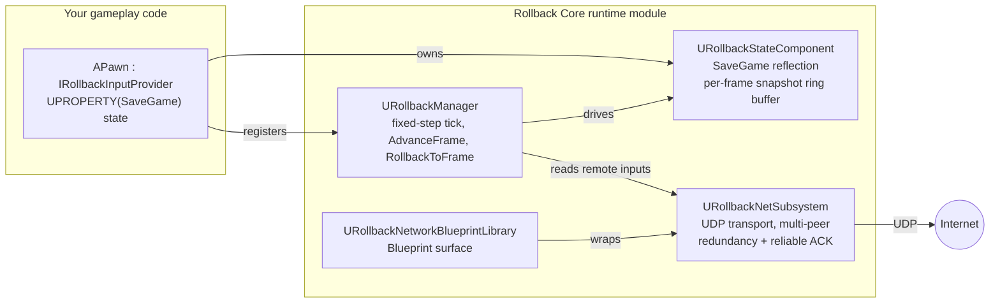

<div align="center">

# Rollback Core

**Deterministic GGPO-style rollback netcode for Unreal Engine 5.**
**MIT-licensed. Drop into `Plugins/`. Ship fighting-game-grade prediction.**

[](LICENSE)
[](https://www.unrealengine.com/)
[](#installation)
[](#)
[](https://github.com/gregorik/Rollback-Core/issues)
[](https://github.com/gregorik/Rollback-Core/stargazers)

</div>


---

> **TL;DR** — Add `URollbackStateComponent` to a pawn, mark anything you want rolled-back with `UPROPERTY(SaveGame)`, call `URollbackManager::AdvanceFrame()` from your tick. Late-arriving authoritative input? `RollbackToFrame(N)` resimulates from frame N using buffered inputs. The whole thing is ~10 source files, one runtime module, one UDP transport, zero external dependencies beyond stock UE5.
>
> [Read the full manual here.](https://gregorigin.com/Docs/Rollback_Core/)

*If you have consulting and/or custom pipeline integration in mind: I offer dedicated architecture consulting for production games & projects.* 📬 Please [contact me](https://gregorigin.com/contact.html) or see my [extended portfolio](https://www.gregorigin.com/Portfolio/). 👨‍💻 

## Table of contents

- [What is rollback netcode?](#what-is-rollback-netcode)
- [Why this plugin](#why-this-plugin)
- [Architecture at a glance](#architecture-at-a-glance)
- [Install](#install)
- [Quick start](#quick-start)
- [How rollback works here](#how-rollback-works-here)
- [Public API surface](#public-api-surface)
- [Console commands](#console-commands)
- [Project Settings](#project-settings)
- [Determinism rules](#determinism-rules)
- [Tests](#tests)
- [**Rollback Core (OSS) vs Rollback Core Pro (Fab)**](#rollback-core-oss-vs-rollback-core-pro-fab)
- [FAQ](#faq)
- [License & credits](#license--credits)

---

## What is rollback netcode?

Rollback netcode is the prediction strategy invented for fighting games (GGPO, 2006) and now standard across the competitive genre — Street Fighter 6, Guilty Gear Strive, Skullgirls, Mortal Kombat 1. Instead of waiting for the remote player's input (delay-based netcode), each peer **predicts** the opponent will repeat their last input and **simulates the frame immediately**. When the real input arrives later, the simulation **rolls back** to the predicted frame, applies the corrected input, and **fast-forwards** to the present.

The player feels zero local latency. The cost is CPU (resimulating up to ~8 frames per tick) and a hard requirement: **the simulation must be deterministic** — same inputs in, same state out, every time.



## Why this plugin

| If you're building... | Rollback Core fits because... |
|---|---|
| A fighting game | Frame-perfect prediction, deterministic combat state, 60 Hz fixed tick |
| A platform fighter | Multi-peer support (up to 8), per-peer input redundancy |
| Deterministic projectile combat | `SaveGame` reflection auto-snapshots projectile state, no manual serialization |
| A hit-validation layer over Mover/NetPred | Separated systems pattern — see `Docs/network-prediction-mover.md` |
| A rollback feel prototype | Drop in, console-command-host a peer, iterate without writing transport |

## Architecture at a glance



Three subsystems, one component, one Blueprint library, ~13 source files total.

## Install

### Option A — submodule (recommended for git-managed projects)

```sh
cd YourProject
git submodule add https://github.com/gregorik/Rollback-Core.git Plugins/RollbackCore
git submodule update --init --recursive
```

### Option B — clone

```sh
cd YourProject/Plugins
git clone https://github.com/gregorik/Rollback-Core.git RollbackCore
```

### Option C — download ZIP

Download the [latest release](https://github.com/gregorik/Rollback-Core/releases), extract into `YourProject/Plugins/RollbackCore/` (so `RollbackCore.uplugin` sits at that path).

Then **right-click your `.uproject` → Generate Visual Studio project files**, rebuild, and launch. Unreal will auto-enable the plugin once it's present in `Plugins/`.

### Requirements

- Unreal Engine **5.7** (other 5.x versions likely work; only 5.7 is verified — see [Rollback Core Pro](#rollback-core-oss-vs-rollback-core-pro-fab) for multi-version packages)
- Visual Studio 2022 (17.8+) or Visual Studio 2026 — both verified
- Windows 10/11 x64 (other platforms unverified)

## Quick start

### 1. Make a pawn rollback-aware

```cpp
// MyFighter.h
#include "RollbackEntity.h"          // for IRollbackInputProvider
#include "RollbackStateComponent.h"  // for URollbackStateComponent + FRollbackInput

UCLASS()
class AMyFighter : public APawn, public IRollbackInputProvider
{
    GENERATED_BODY()
public:
    AMyFighter();

    UPROPERTY(VisibleAnywhere) URollbackStateComponent* StateComp;

    // Marked SaveGame → automatically captured and restored on every rollback.
    // No need to write serialization code per field.
    UPROPERTY(SaveGame) FVector  Velocity;
    UPROPERTY(SaveGame) int32    Health = 100;
    UPROPERTY(SaveGame) int32    HitstunFramesRemaining = 0;
    UPROPERTY(SaveGame) uint8    FacingDirection = 0;

    virtual bool GetRollbackInput(FRollbackInput& OutInput) override;
};
```

### 2. Wire it up

```cpp
// MyFighter.cpp
AMyFighter::AMyFighter()
{
    PrimaryActorTick.bCanEverTick = true;
    StateComp = CreateDefaultSubobject<URollbackStateComponent>(TEXT("StateComp"));
}

bool AMyFighter::GetRollbackInput(FRollbackInput& OutInput)
{
    // Read your local input. This is called once per rollback frame.
    OutInput.Buttons = LocalButtonsBitmask;
    OutInput.Axes    = FVector(LocalStickX, LocalStickY, 0.f);
    return true;
}
```

### 3. Host and client

```cpp
auto* Net = GetWorld()->GetSubsystem<URollbackNetSubsystem>();

// Host
FRollbackTransportConfig HostCfg;
HostCfg.LocalPort = 7777;
FString Err;
Net->StartUdpPeer(HostCfg, Err);

// Client
FRollbackTransportConfig ClientCfg;
ClientCfg.LocalPort  = 7778;
ClientCfg.RemoteHost = TEXT("203.0.113.42");
ClientCfg.RemotePort = 7777;
Net->StartUdpPeer(ClientCfg, Err);
```

### 4. Or skip code entirely and use the console

```
> Rollback.NetHost 7777
> Rollback.NetClient 203.0.113.42 7777 7778
> Rollback.NetPeers
> Rollback.Perf
```

### 5. Try the included demo

Open `Plugins/RollbackCore/Content/Maps/RC_BasicDemo.umap` and press Play. The demo spawns two pawns with **15 frames of artificial latency** between them and shows live rollback corrections — drag-marker visualizations of where the local prediction landed versus where the corrected resimulation landed.

## How rollback works here

Every world running this plugin gets two world subsystems (`URollbackManager` and `URollbackNetSubsystem`) auto-spawned. Your gameplay does this loop:

```
┌────────────────────────────────────────────────────────────────────┐
│  Per fixed tick (default 60 Hz):                                   │
│                                                                    │
│  1. URollbackManager::AdvanceFrame()                               │
│     → For each registered entity:                                  │
│       • RollbackTick(dt, frame)   — gameplay logic runs            │
│       • SaveRollbackState(frame)  — SaveGame props + transform     │
│                                     written to ring buffer         │
│                                                                    │
│  2. Late authoritative input arrives over UDP                      │
│     → URollbackNetSubsystem buffers it under (PlayerId, Frame)     │
│                                                                    │
│  3. URollbackManager::RollbackToFrame(N)                           │
│     → For each entity: LoadRollbackState(N)                        │
│     → Replay frames N+1 .. Current with corrected inputs           │
│     → Latest state is now authoritative                            │
└────────────────────────────────────────────────────────────────────┘
```

### Why `SaveGame` reflection?

UE's reflection system already lets you mark `UPROPERTY(SaveGame)` for game-save serialization. Rollback Core repurposes that same flag to drive **per-frame** snapshot/restore — so you tag your state once, and it works for both save-files **and** rollback. No extra macros, no manual `Serialize()` overrides, no parallel state classes.

```cpp
// Both rollback AND save-games will round-trip this field. One annotation.
UPROPERTY(SaveGame) int32 CurrentCombo = 0;
```

The component walks the owning actor's properties at `BeginPlay`, caches the `SaveGame`-flagged `FProperty*` pointers, and serializes them into a `TArray<uint8>` per frame. Transform + velocity are captured separately as `FVector`/`FQuat` for cheap restore without going through `Serialize`.

## Public API surface

### `URollbackManager` (world subsystem)

| Method | What it does |
|---|---|
| `AdvanceFrame()` | Tick all registered entities one fixed step; snapshot state |
| `RollbackToFrame(int32 Frame, int32 EarliestMismatch = -1)` | Restore state at `Frame`, replay forward |
| `RegisterEntity(TScriptInterface<IRollbackEntity>)` | Add to the simulated set (auto-called by `URollbackStateComponent`) |
| `DrawDebugState(int32 Frame)` | Draw cached state for a frame |
| `GetDebugFrameRecords(int32 Frame)` | Inspectable per-entity record for one frame |
| `SetDebugScrubFrame(int32)` / `StepDebugScrubFrame(int32)` | Scrub through history (drives any debug UI you build) |

### `URollbackStateComponent` (per-actor)

| Method / property | What it does |
|---|---|
| `CurrentLocalInput` (`FRollbackInput`) | Write here before the next `AdvanceFrame` |
| `InjectInputForFrame(int32 Frame, FRollbackInput)` | Authoritative override for a past frame |
| `GetInputForFrame(int32 Frame)` | Read the input that was used at a past frame |
| `OnRollbackTick` (Blueprint event) | Fired during each deterministic tick — gameplay hook |
| `LastSavedFrame` / `LastRestoredFrame` / `LastSavedByteCount` | Diagnostics |

### `URollbackNetSubsystem` (world subsystem)

| Method | What it does |
|---|---|
| `StartUdpPeer(Config, Error)` | Open the UDP socket and start ticking transport |
| `ConnectToPeer(PlayerId, Host, Port, Error)` | Add a remote peer |
| `SendInputFrame(PlayerId, Frame, Input, bReliable)` | Send (with optional reliable ACK loop) |
| `ConsumeRemoteInput(PlayerId, Frame, OutInput)` | Pop one received frame |
| `BufferRemoteInputForRollback(...)` + `ApplyBufferedInputsToState(...)` | Hand received inputs to a state component and detect what changed |
| `GetTransportStats()` / `GetPerformanceStats()` | Bandwidth, RTT, rollback metrics |
| `FlushTransport()` (DevelopmentOnly) | Force send/receive without waiting for next tick |

### `URollbackNetworkBlueprintLibrary`

Static BP helpers that wrap the above for Blueprint-only projects:

- `MakeLoopbackTransportConfig` / `StartLoopbackPacketLossTransport`
- `SendRollbackInputForCurrentFrame` / `SendRollbackInputToAllPeers`
- `ApplyBufferedInputsAndRollback`
- `ConnectToRemotePeer` / `DisconnectRemotePeer`
- `GetConnectedPeerIds` / `GetAllPeerInfo` / `GetPerformanceStats`

## Console commands

All commands are registered globally and operate on the currently active `UWorld`'s subsystems.

| Command | Args | Purpose |
|---|---|---|
| `Rollback.NetHost` | `[LocalPort=7777] [LossPercent=0] [MaxPeers=4]` | Open a UDP listen socket |
| `Rollback.NetClient` | `<RemoteHost> <RemotePort> [LocalPort=7778] [PlayerId=-1] [LossPercent=0]` | Open + connect to a host |
| `Rollback.NetConnect` | `<RemoteHost> <RemotePort> <PlayerId>` | Add another peer to an already-running transport |
| `Rollback.NetDisconnect` | `<PlayerId>` | Drop a peer |
| `Rollback.NetPeers` | — | List connected peers + RTT + packet counts |
| `Rollback.Perf` | — | Dump full performance stats |

Bind any of these to a key in `DefaultInput.ini` for fast iteration in PIE.

## Project Settings

Surfaced under **Edit → Project Settings → Plugins → Rollback Core**:

| Group | Setting | Default | Range |
|---|---|---|---|
| Simulation | Fixed Tick Rate (Hz) | 60 | 15–240 |
| Simulation | Max Rollback Depth (frames) | 12 | 0–240 |
| Networking | Default Local Port | 7777 | 1024–65535 |
| Networking | Default Input Redundancy (frames) | 8 | 0–32 |
| Networking | Default Max Peers | 4 | 1–8 |
| Networking | Reliable Resend After (seconds) | 0.08 | 0.01–2.0 |
| Networking → Reliability | Heartbeat Interval (seconds) | 2.0 | 0.1–30.0 |
| Networking → Reliability | Peer Timeout (seconds) | 10.0 | 1.0–120.0 |

These are read by `URollbackManager::Initialize` and by anything that constructs an `FRollbackTransportConfig` from defaults.

## Determinism rules

> **Same inputs in, same state out — every single time.** If that statement breaks for one entity on one frame, every peer's prediction silently diverges.

| ✅ Safe inside rollback-authoritative actors | ❌ Will cause desyncs |
|---|---|
| `UPROPERTY(SaveGame)` POD state | `CharacterMovementComponent` |
| Integer-tick countdowns | Mover plugin |
| `FRotator`/`FVector` you fully control | Chaos physics on the rolled-back actor |
| Deterministic LUTs and frame-data tables | Latent Blueprint actions / `Delay` |
| Seeded `FRandomStream` (seed = frame index) | `FTimerManager` callbacks |
| Fixed-step integration | `FMath::Rand*` without a frame-derived seed |
| Anything entirely driven by `FRollbackInput` | `FDateTime::Now`, `FPlatformTime::Seconds` as gameplay input |
| | Async asset loads gating gameplay |
| | Floating-point ops that depend on CPU/SSE rounding mode |

Visuals (meshes, animation, VFX, audio, cameras) are **not** rolled back. They follow the corrected state after rollback. This is what GGPO calls the "deterministic core + visual shell" pattern. See [`Docs/network-prediction-mover.md`](Docs/network-prediction-mover.md) for how to combine Rollback Core with Unreal's Network Prediction or Mover for locomotion while keeping combat deterministic.

## Tests

Automation tests live in [`Source/RollbackCore/Private/Tests/`](Source/RollbackCore/Private/Tests/) under the standard `WITH_DEV_AUTOMATION_TESTS` guard. Eight tests cover:

- State save/restore round-trip via `SaveGame` reflection
- Late authoritative input correction (the canonical rollback case)
- Network input buffer → state component application
- Debug history scrubbing
- Two-peer UDP loopback smoke test
- Three-peer multi-peer connect & input exchange
- Peer-timeout detection
- Performance-stats sanity

Run them from a commandlet:

```sh
"<UE_path>\Engine\Binaries\Win64\UnrealEditor-Cmd.exe" YourProject.uproject ^
  -ExecCmds="Automation RunTests RollbackCore; Quit" ^
  -unattended -nop4 -nosplash -nullrhi
```

Or from the editor: **Tools → Session Frontend → Automation → "RollbackCore"** group.

## Rollback Core (OSS) vs Rollback Core Pro (Fab)

This repository (**Rollback Core**) is MIT-licensed and ships the core simulation, transport, and basic demo — enough to build production fighting/platform-fighter networking without writing a line of rollback or transport code.

**Rollback Core Pro** is a commercial superset on the [Unreal Fab](https://www.fab.com/) marketplace. It targets teams who want plug-and-play matchmaking, an in-editor debugging suite, multi-engine-version packages, and finished demos.

<div align="center">

| | **Rollback Core** (this repo) | **Rollback Core Pro** (Fab) |
|---|:---:|:---:|
| **Price** | Free, MIT | Paid, commercial |
| **License** | MIT | Fab EULA |
| **Source available** | ✓ Full source | ✓ Full source |
| **Engine versions** | 5.7 verified | 5.4 / 5.5 / 5.6 / 5.7 packages |
| **Support** | Community (GitHub Issues) | Direct author support |
| **— Core simulation —** | | |
| Deterministic fixed-step tick | ✓ | ✓ |
| `SaveGame`-reflection state capture | ✓ | ✓ |
| `RollbackToFrame` API | ✓ | ✓ |
| Per-frame ring-buffer history | ✓ | ✓ |
| **— Network transport —** | | |
| UDP transport | ✓ | ✓ |
| Input redundancy + reliable ACK | ✓ | ✓ |
| Multi-peer (up to 8) | ✓ | ✓ |
| Heartbeats + peer-timeout detection | ✓ | ✓ |
| Simulated packet loss + latency | ✓ | ✓ |
| Console commands (`Rollback.Net*`, `Rollback.Perf`) | ✓ | ✓ |
| **— Matchmaking —** | | |
| OnlineSubsystem LAN session discovery | — | ✓ |
| OnlineSubsystem EOS / Steam ready | — | ✓ |
| `CreatePlatformSession` / `FindPlatformSessions` / `JoinPlatformSessionByIndex` | — | ✓ |
| **— Editor tooling —** | | |
| Visual frame-scrubber debugger panel | — | ✓ |
| Per-frame state ghost rendering | — | ✓ |
| Desync inspector with checksum diff | — | ✓ |
| Setup wizard on first project load | — | ✓ |
| Auto-open stats panel in PIE | — | ✓ |
| **— Demos & content —** | | |
| Basic top-down demo with latency + correction markers | ✓ | ✓ |
| Network-packet-loss simulator demo | — | ✓ |
| 2D Viking fighter demo (sprite-based, hitboxes, combat metadata) | — | ✓ |
| **— Onboarding —** | | |
| README + Docs | ✓ | ✓ |
| Marketplace documentation page | — | ✓ |
| Step-by-step setup walkthroughs | — | ✓ |
| **— Performance instrumentation —** | | |
| `FRollbackPerformanceStats` (sim/rollback/serialize timing, bandwidth) | ✓ | ✓ |
| Visual stats panel in editor | — | ✓ |

</div>

### Which should you use?

**Choose Rollback Core (this repo) if:**
- You're prototyping and want to see if rollback fits your game
- You already have matchmaking (Steamworks, EOS, custom backend) and just want the simulation + transport
- You're comfortable building your own debug UI
- You need a permissive license for an open project or a commercial title that can't accept a marketplace EULA
- You only target one engine version

**Choose Rollback Core Pro if:**
- You want OnlineSubsystem-backed matchmaking (LAN / EOS / Steam) out of the box
- You want a visual frame-scrubber debugger to inspect rollbacks and desyncs without writing UI
- You need 5.4–5.7 binary packages without maintaining your own backport branches
- You want a worked 2D fighter demo as a starting point
- Time-to-first-rollback-match matters more than license cost

## FAQ

<details>
<summary><strong>Does this work with the GAS (Gameplay Ability System)?</strong></summary>

Partially. GAS ability execution is generally deterministic if you avoid latent tasks, `WaitDelay`, and async loads inside abilities. Replication mode `Mixed` or `Minimal` is friendlier. The recommended pattern is to keep abilities purely as input → instant state change, and let Rollback Core snapshot the resulting attributes via `SaveGame`-flagged `FGameplayAttributeData`.

</details>

<details>
<summary><strong>Does it support dedicated servers?</strong></summary>

The transport is symmetric — any peer can host. There's no client/server asymmetry in the protocol. If you want a server-authoritative topology, run a headless peer and treat its state as ground truth. The plugin won't object.

</details>

<details>
<summary><strong>How does it compare to GGPO / Photon Quantum / Mover?</strong></summary>

GGPO is the foundational rollback algorithm; this plugin implements the same input-prediction + resim concept natively in UE5 without needing C bindings. Photon Quantum is a deterministic ECS with its own simulation runtime — heavier and more opinionated. Mover is Unreal's predicted-movement framework; it's about server-authoritative locomotion, not rollback combat. The clean integration is Mover (or `CharacterMovementComponent`) for locomotion, Rollback Core for combat state. See `Docs/network-prediction-mover.md`.

</details>

<details>
<summary><strong>What's the largest match it can handle?</strong></summary>

The protocol caps at 8 peers. Practical limit depends on your simulation cost — every rollback resimulates every registered entity. Fighting games (2–4 fighters + projectiles) are well within budget at 60 Hz with depth-12 rollbacks on a 2019 CPU. Heavier simulations should reduce `MaxRollbackDepthFrames` or drop the tick rate.

</details>

<details>
<summary><strong>Can I use this in a commercial game?</strong></summary>

Yes. MIT license. No royalties, no attribution requirement beyond preserving the LICENSE file. If you ship something cool, opening an issue to share is appreciated but not required.

</details>

<details>
<summary><strong>Does it support NAT traversal / hole-punching?</strong></summary>

Not in this OSS distribution — it expects you to bring your own connectivity layer (port-forwarded host, relay server, your matchmaking service's `GetResolvedConnectString`, etc.). Rollback Core Pro's OnlineSubsystem path handles this when EOS or Steam is configured.

</details>

<details>
<summary><strong>Why <code>SaveGame</code> for the rollback flag?</strong></summary>

Two reasons. **Pragmatic:** UE projects already use `SaveGame` for save-file serialization, so the property set is curated and matches what you'd want to roll back anyway. **Technical:** the reflection metadata is already cached by the engine, so iteration is essentially free at runtime.

</details>

<details>
<summary><strong>What about UE versions other than 5.7?</strong></summary>

The code targets UE 5.7 APIs but uses no 5.7-exclusive features I'm aware of. 5.4–5.6 should compile with minor or zero modification. If you backport successfully, open a PR with a notes file — would happily merge multi-version support. The Pro version ships verified 5.4/5.5/5.6/5.7 packages.

</details>

## Project layout

```
Rollback-Core/
├── RollbackCore.uplugin          # Plugin descriptor
├── README.md                     # You are here
├── CHANGELOG.md                  # Release notes
├── LICENSE                       # MIT
├── Config/
│   └── FilterPlugin.ini          # Files staged in packaged builds
├── Content/
│   └── Maps/
│       └── RC_BasicDemo.umap     # The included demo
├── Docs/
│   └── network-prediction-mover.md
└── Source/
    └── RollbackCore/
        ├── RollbackCore.Build.cs
        ├── Public/               # 11 header files
        └── Private/
            ├── *.cpp             # 10 implementation files
            └── Tests/
                └── RollbackCoreAutomationTests.cpp
```

## License & credits

MIT — see [LICENSE](LICENSE).

Built by **[gregorik](https://github.com/gregorik)** (GregOrigin) as a companion to the commercial [Rollback Core Pro](https://www.fab.com/) plugin on Fab. The two share their core algorithm; this repo is the public, source-available subset.

Issues, PRs, and discussion welcome at [github.com/gregorik/Rollback-Core](https://github.com/gregorik/Rollback-Core).

---

<div align="center">

**[back to top](#rollback-core)**

</div>
